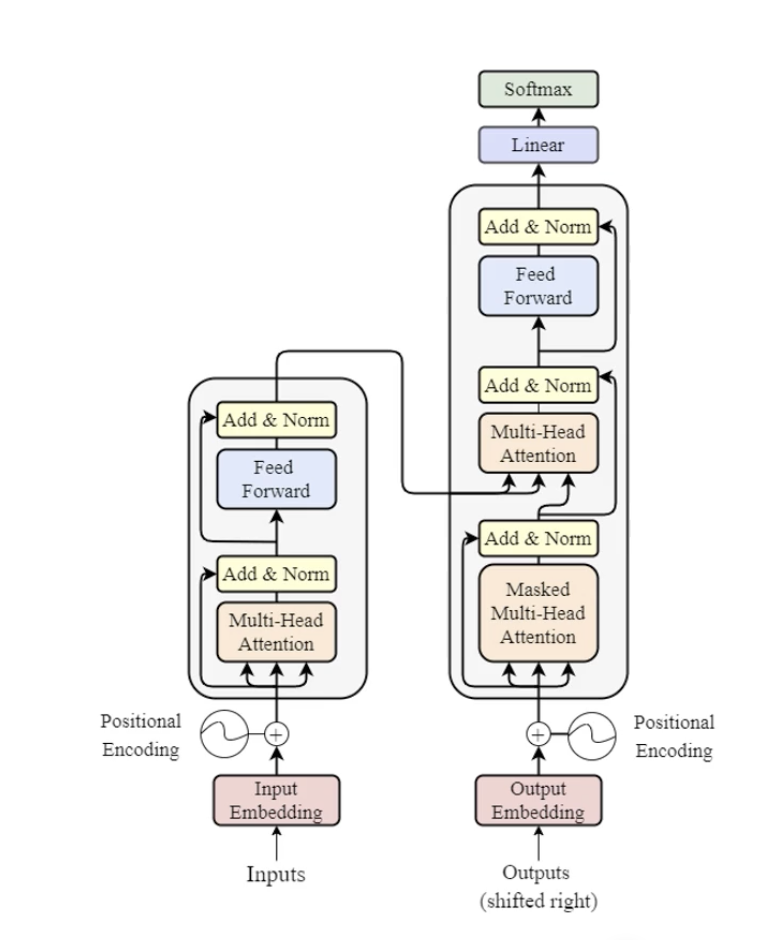

# Introduction to Artificial Neural Networks and Deep Learning

## Short History of Neural Networks

- The history of the neural netowrks can be traced back to the 1940s with the first ideas, and, in 1958 with the perceptron.

- But in 1969, two researchers, Minsky and Papert, published a book called "Perceptrons" that showed the limitations of the perceptron, which led to a decline in interest in neural networks, the so-called "AI winter".

- In 1986, a new algorithm called backpropagation was introduced, which allowed for training of multi-layer neural networks, and this led to a resurgence of interest in neural networks. We still use backpropagation today.

- In 1989, Elman introduced the Recurrent Neural Network (RNN), which is a type of neural network that can process sequences of inputs. This was a major breakthrough for Natural Language Processing.

- In 1997, Hochreiter and Schmidhuber introduced the Long Short-Term Memory (LSTM) cell, which is a type of RNN that can learn long-term dependencies. This was another major breakthrough for NLP.

- In 2012, AlexNet, a deep convolutional neural network, won the ImageNet competition by a large margin, which was a major breakthrough for computer vision.

- In 2017 is published the papper "Attention is All You Need" that introduced the Transformer architecture, which is a type of neural network that can process sequences of inputs in parallel, which is much faster than RNNs.

- In 2020, the first Large Language Model, GPT-3, was released, which is a type of Transformer that can generate human-like text, with billions of parameters, resulting in impressive results on language generation.

- In 2023 a web interface was created to interact with GPT-3, called "Talk to Transformer", which allows users to generate text by typing a prompt.

## Common Deep Learning Architectures

- Dense Neural Networks (DNN)

- Convolutional Neural Networks (CNN)

- Recurrent Neural Networks (RNN)

- Autoenconders

- Generative Adversarial Networks (GANs)

- Architectures that are still on the academic side: Capsule Networks, Transformers, Graph Neural Networks, siamese networks, etc.

- Attention models and Transformers

## Frameworks and tools to build deep learning models

- PyTorch
- TensorFlow and Keras

Both based on Python and C++, the course focus.

Alternatives are: MxNet, JAX, and Open Neural Network Exchange (ONNX).

Libraries to mathematic oprations in C++ to train Deep Learning models: Armadillo, and MLpack.

## Challenges and limitations of Deep Learning

- Requires massive datasets
- Complexity and training time
- Interpretability (it's not a _blackbox_, just a lot of math)
- Bias on training data
- Hardware requirements
- Efficiency for real-time implementation
- Dependence on big architectures

# Fundamentals of Artificial Neural Networks - from perceptron to transformers - I

## Perceptron

- Created in 1957 by Frank Rosenblatt
- The basic unity of a neural network more complex
- The perceptron is the simplified representation of a biological neuron
- It consists in a supervisioned binary classification algorithm - can predict if the input belongs to a class or not
- The structure is composed by:
  - Input layer
  - Weights
  - Weighted sum
  - Activation function
  - Output
  - Weights update
- Is capable to solve **only** problemns that are linearly separable
- Gives the fundations to the neural networks and artificial intelligence

## From the Perceptron to Multi-layer Neural Networks (MLP)

- This transition is a significant step in the history of neural networks and machine learning, a period known as the "AI winter" (1969-1986)
- Perceptron is a single layer neural network, and it can solve only linearly separable problems
- In 1980, researchers started to explore models with multiple layers, and in 1986, the backpropagation algorithm was introduced, which allowed for training of multi-layer neural networks
- These algorithms can solve non-linearly separable problems
- Still today, the backpropagation algorithm is the most used algorithm to train neural networks
- The retropropagation gave the mean to neural networks learn from errors and adjust the weights to minimize the error, not only on the output layer, but also on the hidden layers
- The MLPs are composed by a input layer, one or more hidden layers, and a output layer, each layer with a number of neurons
- Each neuron in the hidden layers can model non-linear interactions between the input, and the addition of multiple hidden layers allows that the network can learn more complex patterns

## Backpropagation

- Based on **Forward pass** and **Backward pass**
- The final output from the forward pass is compared with the true label, and the error is calculated
- This error is the input for the backward pass, which calculates the gradient of the error with respect to the weights
- There is no layer on the forward pass, it is just matrix operation between the input values and the weights
- In the backward pass, is where the learning happens, the weights are updated based on the gradient of the error
- It is about optimize the error function, which is the difference between the predicted output and the true label
  _New weight = old weight - derivative \* learning rate_
- The learning rate is a hyperparameter that controls how much the weights are updated - defined by the user

## Convolutional Neural Networks (CNN) and Recurrent Neural Networks (RNN)

- CNNs are used for image processing, and RNNs are used for sequence processing - like text and speech (NLP)
- CNN is composed by convolutional layers, pooling layers, and fully connected layers
- RNN is composed by recurrent layers, which can process sequences of inputs
- TO solve issues on the regular RNNs, the LSTM and GRU cells were introduced
- It was based on the LTSM architecture that the Transformer architecture was created, which is a type of neural network that can process sequences of inputs in parallel, which is much faster than RNNs

## Generative Neural Networks

- Allows to generate new data based on the training data
- One of the most famous generative models is the Generative Adversarial Networks (GANs) - where two neural networks are trained simultaneously, one to generate data and the other to discriminate between real and generated data

## Attention mechanisms and Transformers

- This course will be totally focused on the Transformer architecture
- Requires a lot of data to train
  
- Vaswan et al. (2017) - Attention is all you need
- It is an architecture which depends entirely on attention mechanisms, without recurrent or convolutional layers
